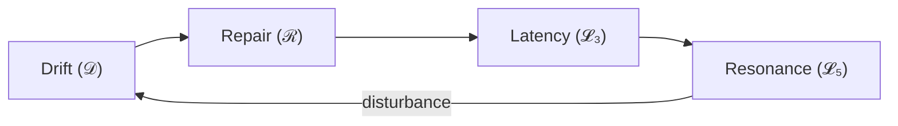

# Translating Phase Loop Dynamics into Human–Computer Interaction  
*(v2.0 – Added Translation Intent and Reviewer-Oriented Orientation)*  

---

## 0. Reading Guide  

**Estimated total reading time:** ≈ 2 hours  

| Section | Time | Difficulty | **How to Approach** |
|----------|------|-------------|---------------------|
| 1 – Introduction | 10 min | 🟢 | Read fully for motivation and notation preview. |
| 2 – Theoretical Background | 20 min | 🟡 | Skim if familiar with Suchman / Clark / Dourish. |
| 3 – Core Concepts | 30 min | 🔴 | Read slowly; refer to Fig 1.3. If stuck, see Section 4. |
| 4 – Drift–Repair–Resonance Cycle | 20 min | 🟡 | Use as visual support for Section 3. |
| 5 – Measurement Framework | 20 min | 🟡 | Focus on how each symbol maps to data. |
| 6 – Discussion | 15 min | 🟢 | Read for implications and boundaries. |
| Appendices | 10 min | 🟢 | Reference only if terminology unclear. |

---

## 0.1 Translation Intent — Why “Translation” Is Needed  

Phase Loop Dynamics (PLD) originated as a formal model of temporal coordination.  
However, its epistemic grammar differs from Human–Computer Interaction (HCI):  
PLD’s symbols describe systemic timing, while HCI interprets lived coordination.  
This “translation” thus rearticulates PLD *into* HCI’s theoretical language—  
turn-taking, grounding, repair, and feedback—so that its temporal mechanics  
become intelligible and evaluable within the HCI canon.  

The translation is **epistemic, not linguistic**: it converts model syntax  
into interpretive theory. This establishes the framework for Parts 2–6.  

---

## 🚀 Fastest Path (90-minute version)

**For an initial evaluation (mirrors typical CHI review window):**

1. Read this Introduction (10 min)  
2. Skim Section 2 (10 min) — focus on 2.1 and 2.7  
3. Read Section 3 (Core Concepts) (30 min) — definitions only  
4. Read Section 5 (Measurement Framework) (20 min) — metrics  
5. Read Section 6.2–6.3 (10 min) — implications & limits  

**After 90 minutes you should know:**  
- Whether PLD fits your research lens  
- How it extends Suchman / Clark / Dourish  
- What measurement constructs it offers  

---

## Intended Readers  

- 🟢 **HCI theorists who have read:**  
  - Suchman (1987) *Plans and Situated Actions* — Chs 1–3  
  - Clark (1996) *Using Language* — Chs 3–5 (on grounding)  
  - Dourish (2001) *Where the Action Is* — Part I  
  **Self-check:** explain “breakdown,” “common ground,” and “embodiment” in 1–2 sentences.  

- 🟡 **Conversation Analysis readers:** Repair organization helpful but not required.  
- 🟢 **Quantitative HCI researchers:** Only basic familiarity with ρ (correlation).  

---

## 1. Introduction  

Human–Computer Interaction (HCI) examines how people and systems coordinate action over time.  
Classic theories—Suchman (1987), Clark (1996), Dourish (2001), Norman (2013)—converge on the view that  
interaction is jointly constructed and temporally organized.  
What remains missing is a compact account of how coordination drifts, recovers, and stabilizes—  
treating silence and echo as structural resources rather than noise.  

**Phase Loop Dynamics (PLD)** fills this gap by reframing interaction as motion through  
a small set of recurrent coordination states linked by temporal loops.  

---

### 1.1 Motivation and Theoretical Gap  

PLD offers a temporal-mechanistic bridge among Suchman, Clark, and Dourish.  
It captures how interaction degrades (Drift 𝒟), recovers (Repair ℛ), and stabilizes (Resonance 𝓛₅) through predictive latency (𝓛₃).  
Thus, the translation is not linguistic but **epistemic** — recasting a formal model into HCI’s interpretive grammar.  

---

### 1.2 Core Premise of PLD in HCI  

PLD treats coordination as motion through recurrent states; each transition is a **temporal affordance**.  

- **Phase (Σ):** recognizable interaction state (turn-taking, grounding, orientation)  
- **Loop (𝓛ᵢ):** recurrent coordination pattern  
- **Drift (𝒟):** grounding deficit  
- **Repair (ℛ):** re-alignment of shared activity  
- **Resonance (𝓛₅):** stabilized alignment  
- **Latency (𝓛₃):** withholding that enables repair or uptake  

---

### 1.3 Novel Contributions of This Translation  

1. Bridges qualitative and quantitative HCI through phase-loop formalization.  
2. Defines operational metrics (δ, t(ℛ), Δt₍L₃₎, ρ) for empirical validation.  
3. Integrates temporal affordance into feedback timing design.  
4. Establishes a stable lexicon (drift / repair / resonance) for HCI analysis.  

---

### 1.4 Scope and Limitations  

Purely theoretical; no implementation or tool content.  
Focus = conceptual translation and measurement mapping only.  

---

### 1.5 Reading Roadmap  

- Part 2 – HCI foundations and gap.  
- Part 3 – Core constructs.  
- Part 4 – Temporal cycle model.  
- Part 5 – Measurement framework.  
- Part 6 – Discussion & future work.  
Appendices – Term governance & conceptual maps.  
