# Part 2 — Temporal Reframing of Classical HCI Theories
*(v2.0 – Cross-disciplinary Edition: Integrated Mapping and Conceptual Triangulation)*

---

## 2.0 Reading Orientation

**Estimated time:** ≈ 20 min **Difficulty:** 🟡  
**Best suited for:** Professors or researchers bridging Conversation Analysis (CA), HCI, and Design Theory.

**Before reading, recall:**  
- *Situated Action* (Suchman 1987) — plans must adapt to contingencies.  
- *Grounding* (Clark 1996) — mutual knowledge as coordination substrate.  
- *Embodiment* (Dourish 2001) — temporal and physical co-presence as meaning.  

**Goal of Part 2:**  
To demonstrate how **Phase Loop Dynamics (PLD)** synthesizes these foundations into a *temporal coordination grammar*, preserving their interpretive richness while introducing measurable parameters.

---

## 2.1 Temporal Reframing of HCI Foundations

PLD treats interaction not as symbolic exchange but as **temporal co-regulation** — an ongoing modulation of rhythm, pause, and recovery.  
This section reinterprets five canonical HCI theories as time-based coordination patterns.

| Classical Framework | Central Mechanism | PLD Reframing | Temporal Indicator | Conceptual Reference |
|----------------------|------------------|----------------|--------------------|----------------------|
| **Suchman (1987)** | Situated breakdown | **Drift (𝒟)** — graded temporal misalignment | δ (drift rate) | Breakdown as recurrent oscillation |
| **Clark (1996)** | Grounding acts | **Repair (ℛ)** — re-alignment within finite window *t(ℛ)* | Repair latency | Temporal grounding cycle |
| **Dourish (2001)** | Embodied coordination | **Resonance (𝓛₅)** — rhythmic entrainment of embodied acts | ρ (resonance strength) | Timing as shared embodiment |
| **Norman (2013)** | Feedback loop | **Latency (𝓛₃)** — temporal affordance enabling recovery | Δt₍L₃₎ | Delay as design material |
| **Sacks et al. (1974)** | Turn-taking systematics | **Loop transitions (𝓛₂–𝓛₄)** — probabilistic exchange rules | Transition probability | Sequential scaffolding |

> **Reader Lens:** If you teach interaction design, note how PLD provides a *measurable time axis* connecting these theories — transforming “situated breakdown” into a repeatable coordination rhythm.

---

## 2.2 Triangulated Mapping: CA ↔ HCI ↔ PLD

PLD bridges **Conversation Analysis (CA)** and **Human–Computer Interaction (HCI)** by introducing a temporal analytic layer.  
CA offers the micro-sequential structure; HCI provides design interpretation; PLD quantifies their rhythm.

```mermaid
flowchart TD
    CA["Conversation Analysis (CA)
Turn-taking, Repair, Silence"]
    HCI["Human–Computer Interaction (HCI)
Feedback, Affordance, Grounding"]
    PLD["Phase Loop Dynamics (PLD)
Temporal Grammar of Coordination"]
    CA --> PLD
    HCI --> PLD
    PLD --> CA
    PLD --> HCI
```

**Figure 2.1 — PLD as a triangulated synthesis of CA and HCI.**

> **Interpretive Note:** PLD does not replace these traditions but *projects them into time-space*, revealing how alignment (resonance) and disruption (drift) follow quantifiable rhythms.

---

## 2.3 From Symbolic to Temporal Models

| Dimension | Classical HCI Focus | PLD Reinterpretation | Practical Implication |
|------------|--------------------|----------------------|-----------------------|
| Representation | Interface objects | Temporal loops of perception–action | Design for rhythm, not state |
| Feedback | Event-based correction | Continuous re-synchronization | Design latency intentionally |
| Grounding | Shared meaning | Mutual temporal prediction | Model timing as cognitive alignment |
| Breakdown | Exceptional event | Predictable oscillation | Detect and use drift cycles |
| Silence | Absence | Temporal affordance | Treat pauses as co-regulative design element |

PLD’s novelty lies not in inventing new constructs, but in **temporalizing existing ones** — converting static coordination models into measurable dynamics.

---

## 2.4 Quantitative Anchors (Overview)

Each theoretical link can be expressed through measurable quantities shared with Parts 3 and 5.

| Construct | Metric | Conceptual Meaning | Empirical Analogue |
|------------|---------|-------------------|--------------------|
| Drift (𝒟) | δ | Coordination error amplitude | Misalignment ratio |
| Repair (ℛ) | t(ℛ) | Response latency to correction | Turn-gap duration |
| Resonance (𝓛₅) | ρ | Coupling strength / entrainment | Cross-correlation coefficient |
| Latency (𝓛₃) | Δt₍L₃₎ | Designed temporal buffer | Silence or hover time |
| Stability (S) | Resonant phase ratio | Fluency of overall loop | Segment time ratios |

> **Reader Lens:** For empirical researchers, this table anchors PLD’s theoretical constructs in directly observable timing data. For theorists, it marks the bridge from *interaction ethnography* to *temporal analytics*.

---

## 2.5 Conceptual Integration Summary

1. **Situatedness becomes cyclic:** PLD models breakdown as recurrent drift rather than a singular disruption.  
2. **Grounding gains a tempo:** Repair unfolds within measurable timing windows, coupling with entrainment.  
3. **Embodiment becomes temporalized:** Synchrony (ρ) becomes an operational marker for shared activity.  
4. **Affordance becomes dynamic:** Latency (Δt₍L₃₎) is treated as an adjustable design parameter, not a flaw.  
5. **Silence becomes structural:** Gaps and pauses are recognized as essential to sustaining rhythm.

> **If you teach HCI Foundations:** Use this section to illustrate how PLD provides a *unifying grammar of coordination* — integrating theory, design, and measurement across disciplines.

---

## 2.6 References

- Clark, H. H. (1996). *Using Language.* Cambridge University Press.  
- Dourish, P. (2001). *Where the Action Is.* MIT Press.  
- Norman, D. A. (2013). *The Design of Everyday Things* (Rev. ed.). Basic Books.  
- Sacks, H., Schegloff, E. A., & Jefferson, G. (1974). *A simplest systematics for the organization of turn-taking for conversation.* *Language, 50*(4), 696–735.  
- Suchman, L. A. (1987). *Plans and Situated Actions.* Cambridge University Press.  
- Stivers, T. (2009). *How important is the gap?* *Discourse Processes, 46*(2–3), 117–149.

---

*(End of Part 2 – Professor-oriented revision)*
